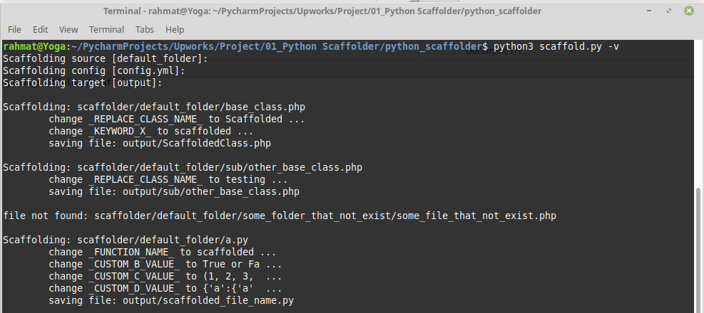
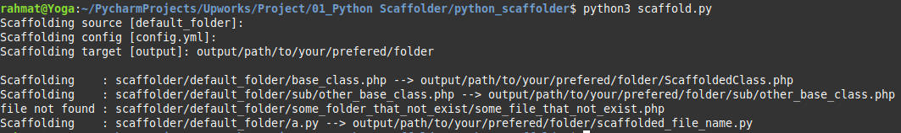
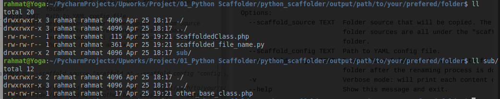

# Python scaffolder

(this doc is work in progress)

##### Information
- requirements: [requirements_01](assets/requirements_01)
- folder hierarchy
  - `assets`: several files for doc
  - `output`: default output folder for scaffolding result
  - `scaffolder`: default directory for storing 
  - `snippets`: literally junk
  - `template`: temporal directory to save the "file content as a template"
- result directory according to the [config.yml](config.yml) directed to `path/to/your/prefered/folder` can be found [here](output/path/to/your/prefered/folder)

##### Usage
```
$ python3 scaffold.py --help
Usage: scaffold.py [OPTIONS]

  Scaffold a given directory recursively to any specified directory with
  predefined YAML config.

Options:
  --scaffold_source TEXT  Folder source that will be copied. The available
                          folder sources are all under the "scaffolder"
                          folder.
  --scaffold_config TEXT  Path to YAML config file.
  --scaffold_target TEXT  Destination folder to be copied to from source
                          folder after the renaming process is done
  -v                      Verbose mode: will print each content change/replace
  --help                  Show this message and exit.


$ python3 scaffold.py --scaffold_source "scaffold_a" --scaffold_config "config.yml" --scaffold_target "output/path/to/your/prefered/folder"

Scaffolding    : scaffolder/scaffold_a/base_class.php --> output/path/to/your/prefered/folder/ScaffoldedClass.php
Scaffolding    : scaffolder/scaffold_a/sub/other_base_class.php --> output/path/to/your/prefered/folder/sub/other_base_class.php
file not found : scaffolder/scaffold_a/some_folder_that_not_exist/some_file_that_not_exist.php
Scaffolding    : scaffolder/scaffold_a/a.py --> output/path/to/your/prefered/folder/scaffolded_file_name.py

```

##### Example of used YAML

```yaml
base_class.php:
  rename_file: ScaffoldedClass
  keywords:
    _REPLACE_CLASS_NAME_: ScaffoldedClass
    _REPLACE_CLASS_CONTENT_:
      file: template/content_file.php
      keywords:
        _KEYWORD_X_: "scaffolded_variable"

sub/other_base_class.php:
  keywords:
    _REPLACE_CLASS_NAME_: testing


# if no file found, will log / throw error
some_folder_that_not_exist/some_file_that_not_exist.php:
    keywords:
      _REPLACE_CLASS_NAME_: testing

# my own testing case: recursively decorate a.py from b, c, d.py
a.py:
  rename_file: scaffolded_file_name
  keywords:
    _FUNCTION_NAME_: scaffolded_function_name
    _FUNCTION_CONTENT_1:
      file: template/b.py
      keywords:
        _CUSTOM_B_VALUE_: "True or False"
    _FUNCTION_CONTENT_2:
      file: template/c.py
      keywords:
        _CUSTOM_C_VALUE_: "(1, 2, 3, 4)"
    _FUNCTION_CONTENT_3:
      file: template/d.py
      keywords:
        _CUSTOM_D_VALUE_: "{'a':{'a' : 'a'}, 'b':{'b' : 'b'}}"

```

###### Verbose mode


###### Without verbose mode


###### Result (according to the self-defined case)



##### Getting started

```
$ cd python_scaffolder
$ pip install -r requirements.txt
```

##### Todo:
  - finish the doc
  - **[DONE]** Test with my own case and YAML config
  - Test with client's case of YAML config
  - my question to client
    - do you have any scaffolding example or case that suits to this testing?
    - should I write unitest?
